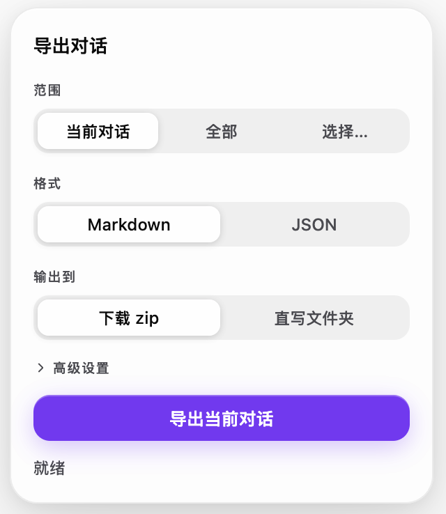
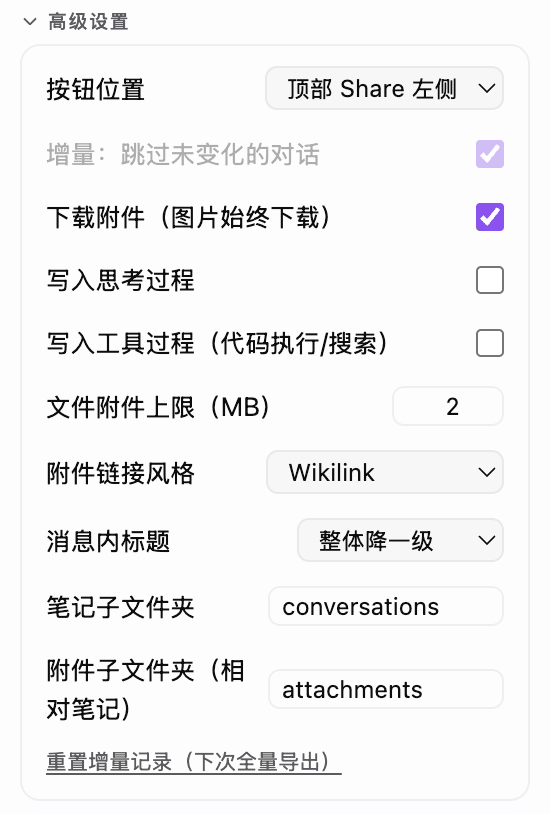
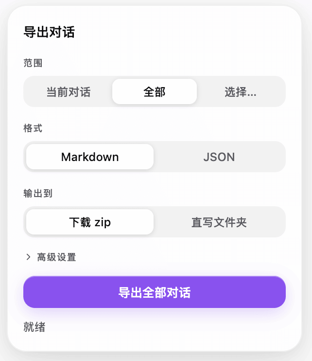
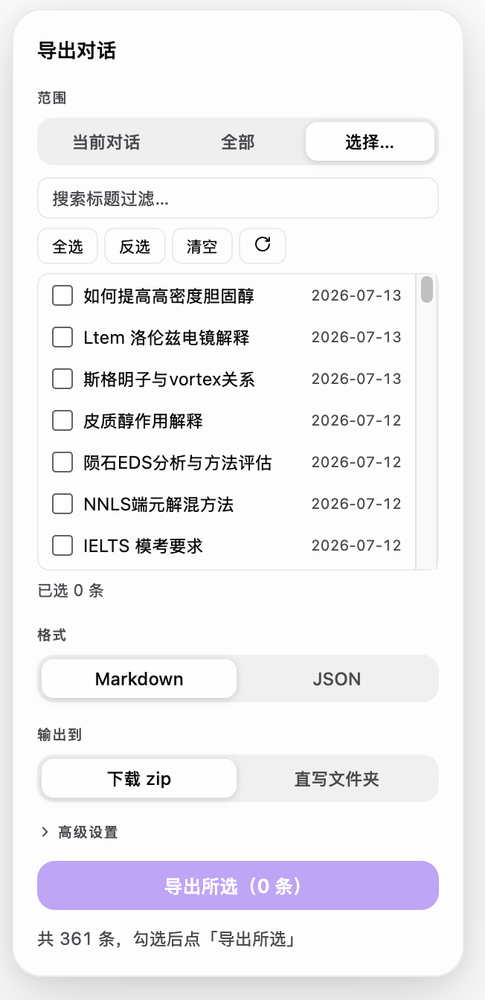
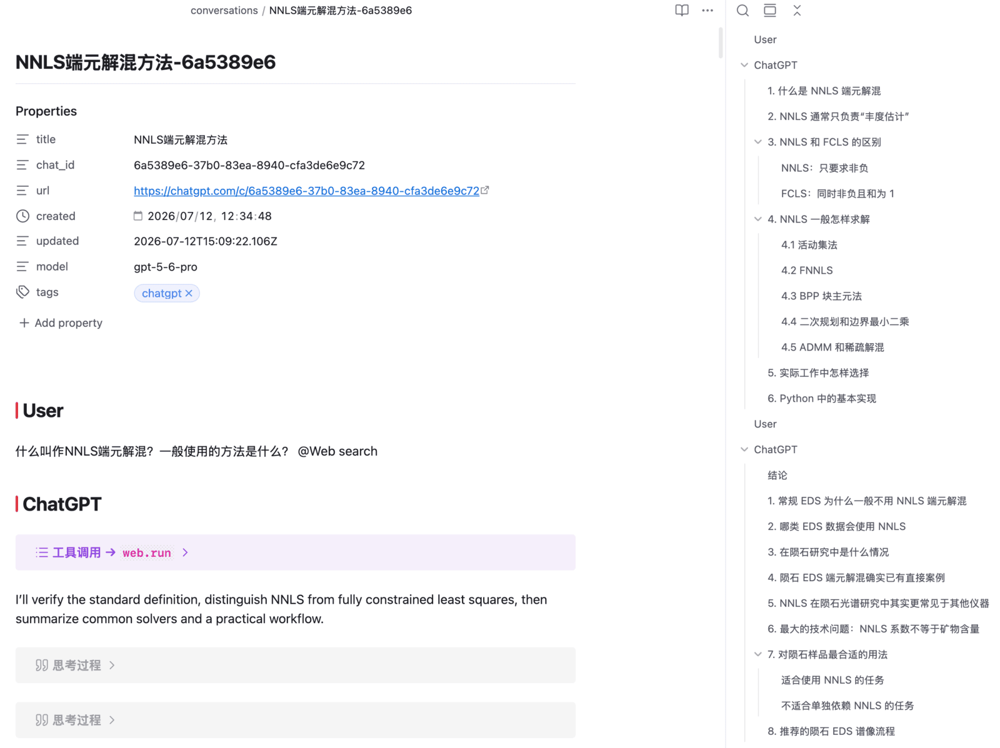
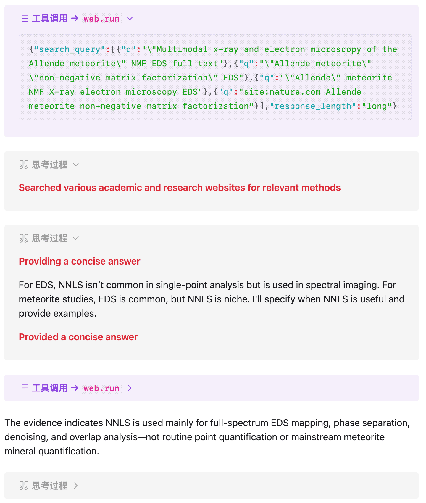
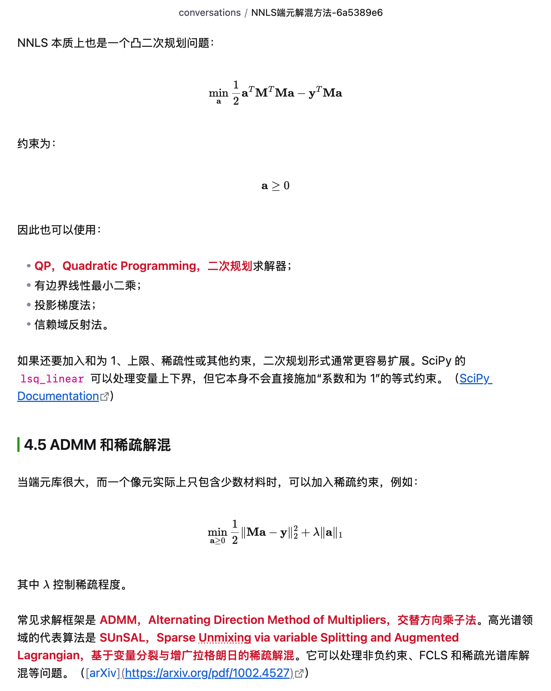
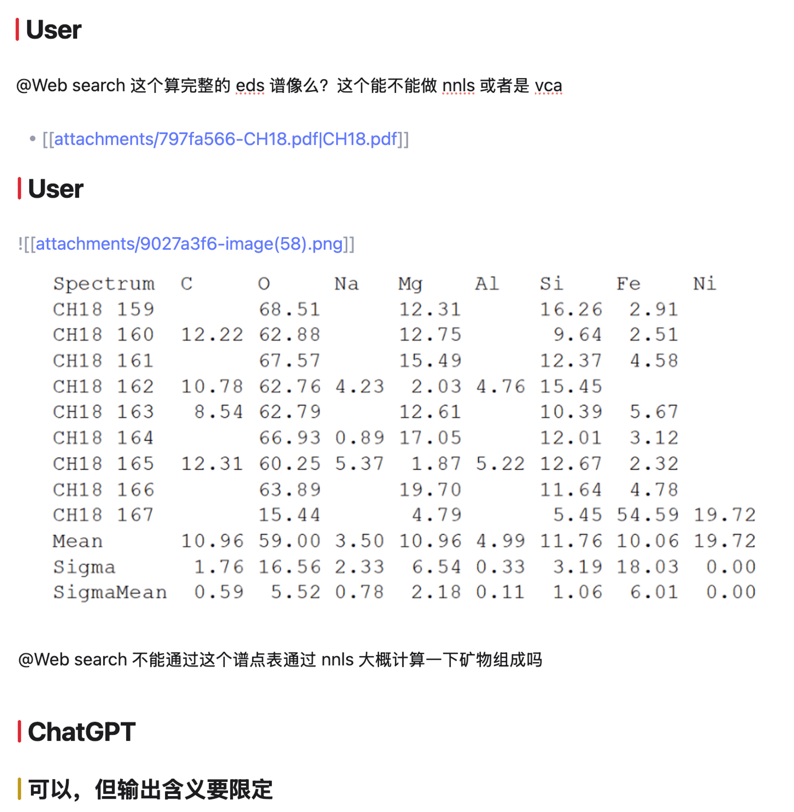

<div align="center">

# Inkstone · 「砚」

**在 chatgpt.com 页内一键批量导出全部对话为 Obsidian 友好的 Markdown——全程本地处理。**

*砚是把原料研磨成墨、供你书写的石头——Inkstone 帮助你把 GPT 的原始输出研磨成能写进笔记的墨。*

[](https://github.com/ZhenHuangLab/inkstone/releases/latest)
[](https://github.com/ZhenHuangLab/inkstone/releases)
[](./LICENSE)
[](https://greasyfork.org/scripts/586688)

[English](./README.md) · **简体中文**

</div>

<p align="center">
  <a href="https://www.tampermonkey.net/"><b>① 安装 Tampermonkey</b></a>
  &nbsp;→&nbsp;
  <a href="https://github.com/ZhenHuangLab/inkstone/releases/latest/download/inkstone.user.js"><b>② 一键安装 Inkstone</b></a>
  &nbsp;→&nbsp;
  <b>③ 打开 chatgpt.com，点 ⤓</b>
</p>

---

## 为什么需要 Inkstone

ChatGPT 的对话历史里沉淀着真正的工作成果，但想把它们搬进 vault 很痛苦：官方导出是一坨原始 JSON——tool/system 消息被剥掉（Canvas、代码解释器的产出根本不在里面），部分附件在服务端已经过期，公式是 Obsidian 不认的 `\( \)` 定界符，联网搜索引用变成私有区 Unicode 乱码。手动复制粘贴撑不过十条对话，更别说上千条。

Inkstone 直接运行在 chatgpt.com 页内，通过应用自己使用的 backend API 抓取对话，然后全部在浏览器本地转换——数据不出页面。产出的 Markdown 在 Obsidian 里原生可读：每轮对话有真实标题、`$` / `$$` 公式、还原后的引用、下载好的图片、干净的 frontmatter。

## 截图

| 界面 UI | 高级设置 |
| ------- | -------- |
|  |  |

| 全部批量导出 | 多选导出 |
| ------- | ------- |
|  |  |

| 直接导出至 obsidian | 保留思考/工具记录 |
| ------- | ------- |
|  |  |

| 保留公式排版与链接 | 保留附件/图片 |
| ------- | ------- |
|  |  |

## Features

### 转换质量

- `# User` / `# ChatGPT` 作为最高级标题分隔轮次，消息内的 H1–H6 整体降一级
- `\( \)` / `\[ \]` → `$` / `$$` 公式定界符转换（代码块感知），货币 `$` 转义
- **引用还原**：联网搜索引用 → 行内 `[来源](url)` 链接 + 文末 `# Sources` 汇总；文件引用 → 文件名说明；还原不了的标记剥离，绝不留乱码
- 思维链、工具运行痕迹（代码解释器代码、搜索请求、运行输出）均折叠 callout 包裹，且**默认都不写入**——高级设置「写入思考过程」「写入工具过程」分别开启（CLI 对应 `--thoughts` / `--tool-traces`）
- 未知内容类型原样保留进折叠 callout，绝不静默丢内容
- frontmatter：`title / chat_id / url / project / created / updated / model / tags`

### 附件

- 对话里的图片全部下载进笔记同目录下的附件子文件夹（默认 `conversations/attachments/`，Obsidian `![[wikilink]]` 内联）
- 用户上传的文件 ≤2MB 下载并链接，超限的留说明占位
- **目录可定制**：笔记子文件夹（默认 `conversations`，可 `a/b` 嵌套、可留空写根目录）与附件子文件夹（默认 `attachments`，相对笔记所在目录、可留空与笔记同层）均可在设置里改；附件链接是相对 .md 的严格相对路径，GitHub/VS Code 预览同样可用
- 「下载附件」开关：关闭后纯文本导出，请求量骤减

### Projects（项目）

Projects 里的对话在「当前 / 全部 / 所选」三种范围下都能导出。主列表接口只返回侧栏「Chats」那份平铺列表，所以 Inkstone 会额外逐个翻每个 project 自己的会话列表，再按 id 合并去重。project 对话的 frontmatter 多一个 `project:` 字段、`url` 带上 `/g/<gizmo-id>` 段，多选列表里也会标出所属项目名。

平铺列表动辄几百条，所以多选列表顶部有个「来源」下拉——全部 / 主列表 / 单个 project，选中某个项目就只拉它的会话，不用一路下滑。

### 增量同步

水位线记录每条对话的 `update_time`，重导只抓有变化的（可关；面板有「重置增量记录」）——重负载的全量抓取一辈子只需一次。

### 原始 JSON 导出

除 Markdown 外还可导出**原始 JSON zip**：数据保险 + 转换器 fixture 来源。

## 安装

1. 浏览器装 [Tampermonkey](https://www.tampermonkey.net/)
2. 点击安装 [最新版 inkstone.user.js](https://github.com/ZhenHuangLab/inkstone/releases/latest/download/inkstone.user.js)（脚本头内置更新地址，之后发新版会自动更新）

或 GreasyFork: [inkstone](https://greasyfork.org/scripts/586688)
或从源码构建：

```bash
bun install
bun run build        # 产物 dist/inkstone.user.js，拖进 Tampermonkey 即可
```

## 使用

打开 chatgpt.com（已登录）→ 点**顶栏 Share 左侧的 ⤓ 按钮** → 选 **Markdown zip** 或**原始 JSON zip** → 解压到 Obsidian vault。

- 按钮位置可换（面板 → 高级设置）：顶栏 Share 旁，或输入框旁的玻璃圆钮
- UI 主题色自动跟随 ChatGPT 的外观设置（明暗 + accent color）
- 可随时取消；单条对话失败不中断整体导出，失败汇总进 `_failures.json`

## 离线 CLI

零风险替代方案：完全离线转换 ChatGPT **官方导出 zip**，不碰 backend API。

```bash
bun run offline <官方导出.zip | 解压目录> [-o 输出目录]
  [--thoughts] [--tool-traces] [--no-assets]
  [--link-style wikilink|markdown] [--heading-mode demote|strip]
  [--notes-dir <名字>] [--attachments-dir <名字>]
```

输出目录结构与油猴导出一致。注意：官方 zip 只含 user/assistant 可见消息——tool/system 载荷（Canvas、代码解释器）被 OpenAI 剥离，部分被引用的附件在服务端已过期（留占位说明）。

## 开发

```bash
bun install
bun run dev          # vite-plugin-monkey 给出一次性安装地址，改代码热更新
bun test             # 转换层单测（纯 TS，无浏览器依赖）
bun run typecheck
bun run build
```

## 路线图

MV3 浏览器扩展（脱离 Tampermonkey、上架商店）、Claude / Gemini 适配。已完成：增量同步、直写 vault、设置面板、Canvas patch 重放、离线 CLI。详见 [PLAN.md](./PLAN.md)。

## 许可证

[GPL-3.0](./LICENSE)

## 友情链接

[LINUX DO](https://linux.do)